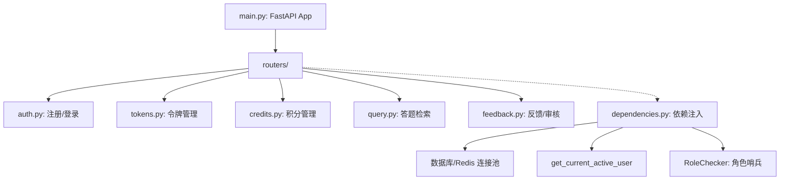

# StudyQuestionBankAssistant 平台化演进设计与接口规范规划

本规划文档旨在将现有的本地“学习型题库助手”平滑演进为一个支持多租户、积分制、细粒度鉴权且符合 FastAPI 规范的高性能**答题管理服务平台**。

通过前后端分离的架构，确保后端只进行轻量、原子的计算与数据持久化，而由前端负责展示层聚合与交互渲染。

---

## 一、 系统架构与身份边界设计

系统引入基于角色的权限控制（RBAC），将用户划分为三个层级，严格定义各自的身份边界与数据访问范围：

| 角色 | 核心职责 | 数据读写边界 | 积分与令牌操作 |
| :--- | :--- | :--- | :--- |
| **超级管理员**<br>`superadmin` | 系统配置、全局积分定价、高级用户管理 | 可读写系统全部数据（配置、日志、反馈） | - 调整各类答题功能的积分扣除额度<br>- 发放积分、创建兑换码与冻结/启用任意账户 |
| **管理员**<br>`admin` | 题库审核、纠错反馈处理、日常运营监控 | 可查看全局日志与反馈列表，更新反馈处理状态，无权修改全局系统积分定价 | - 可为普通用户发放积分并创建积分兑换码<br>- 可协助普通用户重置或排查 Token 问题 |
| **普通用户**<br>`user` | 答题库接入、个人看板查看、纠错提交 | 仅可读写自身数据（个人 Token、个人答题日志、提交的反馈） | - 创建/删除/复制属于自己的答题 Token<br>- 基于个人剩余积分消耗各项答题检索服务 |

---

## 二、 后端规范化重构（FastAPI 规范）

为了使项目符合 FastAPI 的企业级设计规范，后端将进行以下重构：



### 1. 路由与依赖注入（Dependency Injection）
* **依赖哨兵**：使用 `Depends(get_current_user)` 获取当前登录用户，并配合 `Depends(RoleChecker(["admin", "superadmin"]))` 实现路由级权限拦截。
* **统一响应体格式**：所有接口均返回由 Pydantic 定义的规范化响应模型：
  ```json
  {
    "success": true,
    "code": 200,
    "message": "操作成功",
    "data": {}
  }
  ```

### 2. 数据库与积分消耗事务性（ACID）
* **积分防超卖**：积分扣减操作必须在数据库事务中执行，采用行级锁（`SELECT FOR UPDATE`）或 Redis 分布式锁，防止用户多线程并发请求答题导致积分被刷至负数。
* **日志原子化**：积分扣除与答题日志记录必须绑定在同一个数据库事务中，确保“扣积分”与“记录日志”同成功或同失败。

---

## 三、 接口文档设计（RESTful APIs）

### 1. 认证模块（Auth）

#### [POST] `/api/v1/auth/register` (用户注册)
* **权限**：公开
* **请求体 (JSON)**:
  ```json
  {
    "username": "user_demo",
    "password": "SecurePassword123",
    "email": "user@example.com"
  }
  ```
* **响应体 (JSON)**:
  ```json
  {
    "success": true,
    "code": 201,
    "message": "注册成功",
    "data": {
      "user_id": "usr_95a7f23c",
      "username": "user_demo",
      "role": "user",
      "initial_credits": 100
    }
  }
  ```

#### [POST] `/api/v1/auth/login` (登录获取 Token)
* **权限**：公开
* **请求体 (Form Data)**:
  * `username`: `user_demo`
  * `password`: `SecurePassword123`
* **响应体 (JSON)**:
  ```json
  {
    "success": true,
    "code": 200,
    "message": "登录成功",
    "data": {
      "access_token": "eyJhbGciOiJIUzI1NiIsInR5cCI6IkpXVCJ9...",
      "token_type": "bearer",
      "user": {
        "user_id": "usr_95a7f23c",
        "username": "user_demo",
        "role": "user"
      }
    }
  }
  ```

---

### 2. 答题令牌管理模块（Token Management）

#### [POST] `/api/v1/tokens/create` (创建答题令牌)
* **说明**：普通用户可创建供 OCS 等客户端脚本调用题库所使用的专属接入 Token。
* **权限**：普通用户
* **请求体 (JSON)**:
  ```json
  {
    "name": "我的浏览器脚本接入",
    "description": "用于 Chrome 浏览器 Tampermonkey 脚本"
  }
  ```
* **响应体 (JSON)**:
  ```json
  {
    "success": true,
    "code": 201,
    "message": "令牌生成成功",
    "data": {
      "token_id": "tok_ab4923",
      "name": "我的浏览器脚本接入",
      "access_key": "stqb_ak_83bd82a931de7e483b2",
      "created_at": "2026-06-08T10:30:00Z",
      "ocs_config_snippet": "http://127.0.0.1:8765/ocs/query?token=stqb_ak_83bd82a931de7e483b2"
    }
  }
  ```

#### [GET] `/api/v1/tokens` (获取个人令牌列表)
* **权限**：普通用户

#### [DELETE] `/api/v1/tokens/{token_id}` (吊销令牌)
* **权限**：普通用户

---

### 3. 积分消费控制模块（Credit System）

#### [GET] `/api/v1/credits/config` (获取当前积分扣减额度配置)
* **权限**：所有已登录用户

#### [PUT] `/api/v1/credits/config` (更新积分扣除定价)
* **权限**：超级管理员 (`superadmin`)
* **请求体 (JSON)**:
  ```json
  {
    "ocs_query_cost": 1,
    "web_search_cost": 2,
    "ai_answering_cost": 5,
    "daily_free_limit": 50
  }
  ```
* **响应体 (JSON)**:
  ```json
  {
    "success": true,
    "code": 200,
    "message": "全局积分定价策略更新成功",
    "data": {
      "updated_by": "usr_superadmin",
      "configs": {
        "ocs_query_cost": 1,
        "web_search_cost": 2,
        "ai_answering_cost": 5,
        "daily_free_limit": 50
      }
    }
  }
  ```

#### [POST] `/wallet/grants` (手动发放积分)
* **权限**：管理员或超级管理员 (`admin` / `superadmin`)
* **请求体 (JSON)**:
  ```json
  {
    "username": "demo_user",
    "kind": "points",
    "points": 500
  }
  ```

---

### 4. 答题检索模块（Query/OCS API）

#### [GET/POST] `/ocs/query` (OCS 兼容答题接口)
* **说明**：脚本调用，采用 URL 参数中附带 Token 或 Header 中附带 Token 鉴权。自动根据结果的解析类型（精确匹配/网络检索/大模型求解）扣减对应积分。
* **鉴权方式**：校验 URL 中的 `?token=stqb_ak_...`
* **响应体 (JSON)**:
  ```json
  {
    "code": 0,
    "message": "query_success",
    "data": {
      "question": "什么是 FastAPI 中的依赖注入？",
      "answer": "依赖注入是一种在声明中自动处理函数或路径操作所需外部依赖的机制。",
      "resolution_mode": "ai_cache",
      "credits_consumed": 1,
      "remaining_credits": 89
    }
  }
  ```

---

### 5. 纠错与反馈模块（Feedback）

#### [POST] `/api/v1/feedbacks` (提交答题纠错反馈)
* **权限**：普通用户
* **请求体 (Multipart Form)**:
  * `log_id`: `log_73dbe92a` (关联的答题历史记录 ID)
  * `reason`: "大模型给出的解析完全颠倒了，标准答案应该选B"
  * `image`: (Binary, 可选图片附件文件)
* **响应体 (JSON)**:
  ```json
  {
    "success": true,
    "code": 201,
    "message": "纠错反馈已提交，感谢您的贡献",
    "data": {
      "feedback_id": "fb_38472dae",
      "status": "pending"
    }
  }
  ```

#### [GET] `/api/v1/admin/feedbacks` (获取全局纠错列表)
* **权限**：管理员/超级管理员
* **查询参数**：`status` (pending/resolved/rejected), `limit`, `offset`

#### [PATCH] `/api/v1/admin/feedbacks/{feedback_id}` (处理纠错反馈)
* **权限**：管理员/超级管理员
* **请求体 (JSON)**:
  ```json
  {
    "status": "resolved",
    "admin_notes": "确认答案有误，已手动订正本地 verified.jsonl 题库"
  }
  ```

---

### 6. 数据看板模块（Dashboard）

#### [GET] `/api/v1/dashboard/trends` (获取使用趋势与用量)
* **权限**：普通用户（仅查自己）/ 管理员（可查全局）
* **查询参数**:
  * `start_date`: "2026-06-01"
  * `end_date`: "2026-06-07"
* **响应体 (JSON)**:
  ```json
  {
    "success": true,
    "code": 200,
    "message": "数据获取成功",
    "data": {
      "summary": {
        "total_queries": 450,
        "exact_match_count": 320,
        "ai_match_count": 130,
        "credits_spent": 970
      },
      "daily_trends": [
        {
          "date": "2026-06-01",
          "query_count": 80,
          "credits_spent": 120
        }
      ]
    }
  }
  ```

---

## 四、 前端功能规划与职责边界

为了避免后端过度处理复杂的视图层展示计算，前端和后端的职责划分如下：

```
┌───────────────────────────────────────┐
│              前端客户端               │
│ - 根据选定的时间跨度，本地缓存趋势数据   │
│ - 处理多图表多视角的聚合与百分比计算   │
│ - 生成 OCS 脚本完整的快捷复制配置信息   │
└──────────────────┬────────────────────┘
                   │  HTTP RESTful API
                   ▼
┌───────────────────────────────────────┐
│              后端服务端               │
│ - 提供纯粹的行记录分页列表 (不包揽计算)│
│ - 仅提供带索引优化的时间区间聚合原始值 │
│ - 严守数据库级事务，安全增扣账户积分    │
└───────────────────────────────────────┘
```

### 1. 令牌（Token）管理页面
* **快捷复制生成器**：
  * 提供一键生成 “OCS 浏览器助手” 所需的 JSON 配置代码，并附带复制按钮。
  * 自动将当前的 Token 值渲染进脚本配置段中，提供完整的复制气泡提醒。

### 2. 使用日志与纠错中心
* **日志分页检索**：
  * 支持按答题源（`本地题库`/`AI计算`）、正确性状态、时间区间、积分消耗区间过滤。
  * **前端性能防卡死**：限制前端默认每次请求只拉取 20 条，通过无线滚动（Infinite Scroll）或分页组件展示，不一次性渲染上千条 DOM 节点。
* **一键提交纠错弹窗**：
  * 日志列表中每一行均有一个 “反馈/纠正” 按钮。
  * 悬浮窗可输入文本、上传图片，并调用图片压缩库（如 `canvas` 压缩）先在客户端完成图片尺寸限制和压实，再通过表单流上传给后端，减小服务器带宽消耗。

### 3. 数据看板页面（看板性能防护）
* **时间粒度自动降级**：
  * 当用户选择跨度在 `7天内` 时，前端按“小时”渲染折线图。
  * 当选择跨度在 `30天内` 时，前端按“天”显示条形图。
  * 当选择跨度跨年或大于 `90天` 时，前端提示并强制按“周/月”进行粒度降级显示，避免向后端发起庞大的点集请求。
* **数据离线混淆/缓存**：
  * 看板趋势图表的数据在 5 分钟内重复刷新时，前端优先采用 `localStorage` 的图表状态缓存，防范用户频繁刷新造成的服务计算风暴。
