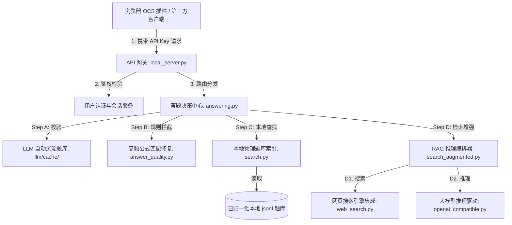
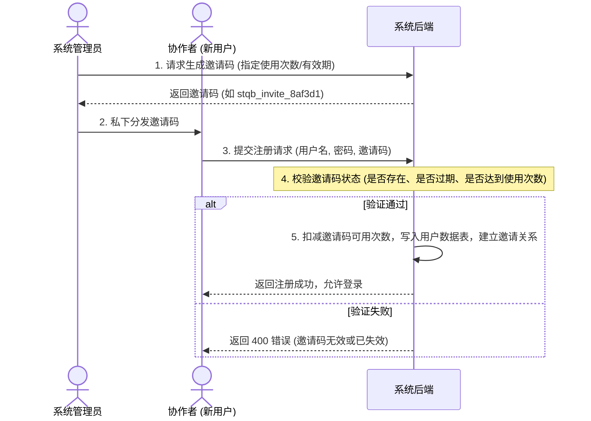

# StudyQuestionBankAssistant - 系统架构与详细设计说明书

## 文档元信息
*   **系统名称：** 本地学习题库与检索增强大模型答题助手 (StudyQuestionBankAssistant)
*   **版本号：** V1.0.0
*   **编写日期：** 2026-06-07
*   **文档类型：** 详细系统架构与接口设计规范 (System Design Document - SDD)
*   **核心语言：** 全局系统、控制台界面及文档默认且必须使用 **简体中文**

---

## 一、 系统概述与核心边界 (System Overview & Boundaries)

### 1. 项目背景与宗旨
本系统是一款针对个人学习、研究参考及教学备考设计的本地化题库检索与检索增强（RAG）答题助手。系统致力于解决个人备考中大模型生成答案存在幻觉（Hallucination）的问题，通过构建“本地题库优先、公共规则前置、搜索引擎增强、大模型Fallback兜底、人工审核质检”的决策链路，生成高置信度、带解析与引文的智能辅助解答。

### 2. 系统业务红线与边界
根据 `AGENTS.md` 安全规范，本系统明确划定如下开发与业务红线：
*   **允许范围：** 搭建可维护的本地/局域网题库检索服务；支持接入本地离线（如 Ollama, vLLM）或商业大模型；提供可视化的“待审核”纠错与答案质检界面；保护数据隐私。
*   **严禁范围：** 系统不涉及、不提供任何针对在线考试、课程平台、作业提交系统的自动登录与答案自动提交表单行为；不提供验证码破解及反作弊系统对抗逻辑。

---

## 二、 总体系统架构 (System Architecture)

系统基于 Python 标准库的轻量化多线程 HTTP 服务构建，前端控制台采用纯 HTML5 + 现代 CSS（Glassmorphism）+ 原生 JS 驱动，实现了高内聚低耦合的分布式决策结构：



---

## 三、 用户认证与邀请流设计 (Auth & Invitation Workflow)

由于系统内置了在线联网搜索引擎及大模型 Fallback 推理功能，为了防止大模型 Token 额度及搜索 API 被恶意刷取，系统引入了**用户注册、登录控制以及管理员邀请码（Invitation Code）**机制。

### 1. 会话与登录流程 (Login Flow)
*   **认证技术：** 采用轻量化 JWT（JSON Web Token）或服务端 Session。登录成功后，服务器向客户端下发带有签名的 Token，后续管理操作（导入题库、吊销 API 密钥、修改推理源）均需携带该 Token 进行鉴权。
*   **普通用户视角：** 登录后可查看匹配趋势、使用题库检索工具、查看题目 AI 详析、生成自己个人的 OCS API Key。
*   **管理员视角：** 拥有全局只读与写入特权，可生成新的邀请码、管理其他用户、导入物理题库及修改全局 LLM 代理参数。

### 2. 邀请注册流程 (Invitation & Registration Flow)
为确保注册用户均为受信任的协作者，注册时必须验证由系统管理员生成的邀请码。



---

## 四、 数据库物理模型设计 (Database Schema Design)

系统采用轻量化关系型结构设计（可使用 SQLite 进行本地化单文件持久化），定义以下五张核心数据表：

### 1. 用户基本信息表 (`users`)
记录注册用户及权限角色：
```sql
CREATE TABLE users (
    id VARCHAR(36) PRIMARY KEY,          -- 唯一标识 (UUID)
    username VARCHAR(50) UNIQUE NOT NULL,-- 用户名
    password_hash VARCHAR(255) NOT NULL, -- 密码的 PBKDF2 或 bcrypt 安全哈希密文
    role VARCHAR(20) DEFAULT 'user',    -- 角色角色：'admin' (管理员) 或 'user' (普通用户)
    status VARCHAR(20) DEFAULT 'active', -- 状态：'active' (正常) 或 'disabled' (冻结)
    created_at TIMESTAMP DEFAULT CURRENT_TIMESTAMP
);
```

### 2. 注册邀请码表 (`invitation_codes`)
控制注册权限的核销记录：
```sql
CREATE TABLE invitation_codes (
    code VARCHAR(50) PRIMARY KEY,        -- 邀请码文本 (如 stqb_invite_xxxx)
    creator_id VARCHAR(36) NOT NULL,     -- 创建者 ID (关联 users.id)
    max_uses INT DEFAULT 1,              -- 最大可使用次数 (如一次性或多次共用)
    used_uses INT DEFAULT 0,             -- 当前已注册使用次数
    expired_at TIMESTAMP,                -- 过期失效时间 (可空，表示永久有效)
    status VARCHAR(20) DEFAULT 'active', -- 状态：'active' (有效), 'exhausted' (次数用尽), 'expired' (已过期)
    created_at TIMESTAMP DEFAULT CURRENT_TIMESTAMP,
    FOREIGN KEY(creator_id) REFERENCES users(id)
);
```

### 3. API 访问密钥表 (`api_keys`)
关联特定用户，用以 OCS 客户端连接的免密认证：
```sql
CREATE TABLE api_keys (
    id VARCHAR(36) PRIMARY KEY,          -- 主键标识 (UUID)
    key_hash VARCHAR(64) UNIQUE NOT NULL,-- API 密钥哈希值 (用于服务端校验)
    key_mask VARCHAR(20) NOT NULL,       -- 遮罩展示 (如 sk_stqb_8af2c...1c)
    description VARCHAR(100),            -- 密钥用途说明 (如 "小明手机端 Tampermonkey")
    user_id VARCHAR(36) NOT NULL,        -- 归属用户 ID (关联 users.id)
    usage_count INT DEFAULT 0,           -- 累计请求查题次数
    status VARCHAR(20) DEFAULT 'active', -- 状态：'active' (激活) 或 'revoked' (已吊销)
    created_at TIMESTAMP DEFAULT CURRENT_TIMESTAMP,
    last_used_at TIMESTAMP,
    FOREIGN KEY(user_id) REFERENCES users(id)
);
```

### 4. 本地索引题库表 (`questions`)
物理导入的归一化标准题库表：
```sql
CREATE TABLE questions (
    id VARCHAR(64) PRIMARY KEY,          -- 题目唯一哈希键 (基于题干和归一化选项生成)
    title TEXT NOT NULL,                 -- 原始题干标题
    normalized_title TEXT NOT NULL,      -- 归一化后去除标点与空白的匹配键
    options TEXT,                        -- JSON 字符串数组格式保存的选项列表
    answer VARCHAR(100) NOT NULL,        -- 标准答案 (如 "C" 或多选 "A#B")
    explanation TEXT,                    -- 知识解析与推理支撑
    source VARCHAR(50),                  -- 数据来源 (如 cmmlu, agieval, manual)
    review_status VARCHAR(20) DEFAULT 'verified', -- 状态：'verified' (已归档) 或 'pending' (人工纠错审核中)
    created_at TIMESTAMP DEFAULT CURRENT_TIMESTAMP
);
```

### 5. 查询审计日志表 (`query_audit_logs`)
用于汇总控制台大盘图表数据及运行历史：
```sql
CREATE TABLE query_audit_logs (
    id INTEGER PRIMARY KEY AUTOINCREMENT,
    api_key_id VARCHAR(36),              -- 调用的 API Key ID (可空)
    query_title TEXT NOT NULL,           -- 查询题干
    resolved_mode VARCHAR(30) NOT NULL,  -- 匹配路径：'local-hit', 'rule-fix', 'llm-fallback', 'error'
    confidence FLOAT DEFAULT 1.0,        -- 置信度分数
    elapsed_ms INT NOT NULL,             -- 处理用时（毫秒）
    response_answer TEXT,                -- 返回的最终答案
    created_at TIMESTAMP DEFAULT CURRENT_TIMESTAMP,
    FOREIGN KEY(api_key_id) REFERENCES api_keys(id)
);
```

---

## 五、 API 接口契约规范 (API Endpoint Contract)

所有接口统一基于 JSON 格式交换数据，路径前缀符合项目路由规范。

### 1. 用户注册接口 (`POST /auth/register`)
*   **用途：** 协作者验证邀请码并注册账号。
*   **请求体：**
    ```json
    {
      "username": "student_xiaoming",
      "password": "SecurePassword123",
      "invite_code": "stqb_invite_8af3d1"
    }
    ```
*   **成功响应 (200 OK)：**
    ```json
    {
      "ok": true,
      "message": "注册成功，账号已激活"
    }
    ```
*   **失败响应 (400 Bad Request)：**
    ```json
    {
      "ok": false,
      "error": {
        "code": "INVALID_INVITATION_CODE",
        "message": "邀请码已失效或已达使用次数上限"
      }
    }
    ```

### 2. 用户登录接口 (`POST /auth/login`)
*   **用途：** 输入账号密码以获取会话 Token。
*   **请求体：**
    ```json
    {
      "username": "student_xiaoming",
      "password": "SecurePassword123"
    }
    ```
*   **成功响应 (200 OK)：**
    ```json
    {
      "ok": true,
      "token": "eyJhbGciOiJIUzI1NiIsInR5cCI6IkpXVCJ9...",
      "user": {
        "username": "student_xiaoming",
        "role": "user"
      }
    }
    ```

### 3. 生成邀请码接口 (`POST /auth/invitations/generate`)
*   **权限限制：** 仅 `role == 'admin'` 可调用。
*   **请求体：**
    ```json
    {
      "max_uses": 5,                     // 允许被注册 5 次
      "valid_days": 7                    // 7 天内有效
    }
    ```
*   **成功响应 (200 OK)：**
    ```json
    {
      "ok": true,
      "invite_code": "stqb_invite_de4f90a",
      "expired_at": "2026-06-14T16:38:22Z"
    }
    ```

---

## 六、 界面视觉配色与布局设计说明

控制台界面完全采用简体中文，视觉体验基于 **Space Dark Mode (深空毛玻璃暗黑)** 风格。

### 1. 色彩配方系统 (Detailed Color Tokens)

| 配色名称 | 具体参数 (Hex/RGBA) | UX 界面交互心理学设计考量 |
| :--- | :--- | :--- |
| **深空底板色** | `#090616` | 去除刺眼的纯黑，采用偏冷色调的深紫色黑，作为基底，能够有效舒缓夜间查题复习的眼部疲劳。 |
| **毛玻璃高感卡片** | `rgba(22, 17, 47, 0.45)` | 配以 `backdrop-filter: blur(12px)`，展现悬浮玻璃层次，拉开图表、表单与底图的视觉纵深。 |
| **微光描边线** | `rgba(147, 51, 234, 0.15)` | 对卡片边缘勾以纤细的紫罗兰反光线，保证暗色堆叠时依然有分界轮廓。 |
| **主激活/导航高亮** | `#8b5cf6` | 饱和度极佳的紫罗兰色，引导用户的视线焦点移动，作为主要的操作按钮背景。 |
| **本地命中指示色** | `rgba(16, 185, 129, 0.15)` | 前景字 `#10b981` 的亮绿色。心理学上绿色代表“安全、通行”。告知用户该题属于本地库精准匹配，置信度 100%，无需担心 LLM 幻觉。 |
| **人工审核指示色** | `rgba(245, 158, 11, 0.15)` | 前景字 `#f59e0b` 的琥珀黄色。黄色代表“警告、防范”。明示该答案由大模型 fallback 或低置信度链路得出，建议人工二次查阅确认。 |

### 2. Spacing 系统与响应式规范
*   **8px 栅格步进：** 布局间隙严格以 `8` 的倍数进行偏移。控制台外层容器 Padding 统一为 `40px`，卡片内留白 `24px`，行高与间隙分别设定为 `16px` 和 `8px`。
*   **图表设计：** 控制台中的 QPS 负荷折线图和命中环形图以 SVG 格式嵌入，采用紫到粉的线性渐变（`#8b5cf6` $\rightarrow$ `#ec4899`），图表网格线淡化处理，只传达全局趋势，不造成视觉喧宾夺主。

---

## 七、 提示词工程（Prompt Engineering）体系设计

为约束大模型在Fallback兜底答题时以严格的 JSON 响应，系统设计了统一的格式约束提示词。

### 1. 系统角色提示词 (System Instructions)
```markdown
Role: 你是一个专业的题库分析与解答适配器。你的输出被下属自动化程序直接调用，因此你必须保持极其精准的逻辑与严格的输出格式。

Format Constraint:
你必须输出且仅输出一个符合 RFC 8259 规范的 JSON 对象。此 JSON 对象必须包裹在 ```json 和 ``` 的 Markdown 代码块中。在代码块之外，严禁输出任何引言、问候、分析过程、附录或额外文字。

Structure Constraint:
JSON 对象必须包含以下字段：
{
  "candidate_answer": "正确候选项的字母标号（如 A 或多选题以字母顺序通过 '#' 拼接如 A#C），如果是判断正误题，必须直接输出 '对' 或 '错' 字符串",
  "answer_text": "该正确选项对应的中文文本，判断题则同样输出 '对' 或 '错'",
  "confidence": 0.0 到 1.0 之间的置信度分数,
  "explanation": "详尽且专业的学术解析，用以论证该选项的正确性"
}
```

### 2. 外部 RAG 参考证据上下文注入格式 (User Ingestion)
```markdown
【已通过搜索引擎检索到的外部事实证据如下】：
---
[参考证据 1] 标题: {{doc_title}}
内容摘要: {{doc_snippet}}
---
[参考证据 2] 标题: {{doc_title}}
内容摘要: {{doc_snippet}}
---

【待解答题目信息】：
题干: {{question_title}}
选项:
{{formatted_options}}

请严格结合上述检索到的外部参考证据，做出最客观、逻辑一致的判定，并格式化输出 JSON 代码块。
```
